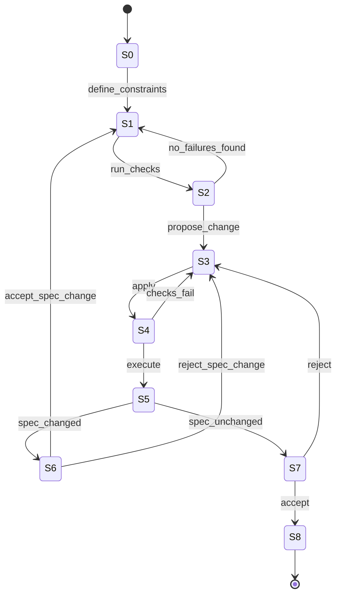

# 02 — State Machine + Audit Isomorphism

This workflow is a simple state machine where **each transition produces or requires a concrete audit artifact**.

## States

- S0 Intent
- S1 Harness
- S2 Red
- S3 Change
- S4 Run
- S5 Integrity
- S6 SpecAudit
- S7 HumanGate
- S8 Done

## Diagram (Mermaid)

## Audit artifacts (minimum)

- MiniSpec (`mini_spec`)
- CheckSuiteRef (`check_suite`)
- FirstRed (`first_red`)
- DiffSet (`diff_set`)
- FinalGreen (`final_green`)
- SpecDelta (`spec_delta`, optional unless meaning changed)

## Transition → Audit mapping (isomorphism)

- S0→S1 produces `mini_spec`
- S1→S2 consumes `check_suite` and produces `first_red` if failures exist
- S2→S1 (no failures) means harness must be refined; record is invalid until `first_red.occurred=true`
- S2→S3 produces draft `diff_set` (base_ref known)
- S3→S4 updates `diff_set.files_changed`
- S4→S5 produces run evidence used by `final_green`
- S4→S3 (fail) iterates by producing new diff candidates
- S5→S7 produces `spec_delta.changed=false`
- S5→S6 produces `spec_delta.changed=true` + explicit before/after
- S6→S1 sets `spec_delta.human_decision=accepted` and restarts honestly
- S6→S3 sets `spec_delta.human_decision=rejected` and returns to implementation
- S7→S8 produces `final_green` (pass evidence) only after human acceptance

## Spec-weakening detection (conservative heuristics)

Flag `spec_changed=true` if any:
- failing test deleted/skipped,
- assertion relaxed (== → <=, required → optional),
- negative expectation removed,
- constraint narrowed without explicit out_of_scope,
- timeouts/limits loosened,
- negative coverage removed.

Humans may override only via explicit `spec_delta` entries.
